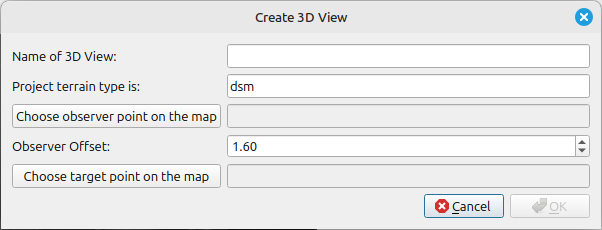

# Create 3D View with Camera Setup

This tool sets up 3D View (3D Map Canvas) with camera at specific observer point offset above rasters looking towards specified target point. This allows rendering the 3D Map for specific viewer.

## Parameters

| Label                            | Type     | Description                                                                               |
| -------------------------------- | -------- | ----------------------------------------------------------------------------------------- |
| Name of 3D View                  | [string] | Name of the 3D view.                                                                      |
| Rasters                          |          | List of rasters that will be used to extract elevation. (not editable - only informative) |
| Choose observer point on the map | [point]  | Point from the map (if snapping is enabled the tool honors the settings).                 |
| Observer offset above raster     | [number] | Elevation offset from the selected raster.                                                |
| Choose target point on the map   | [point]  | Point from the map (if snapping is enabled the tool honors the settings).                 |

## Tool screenshot

