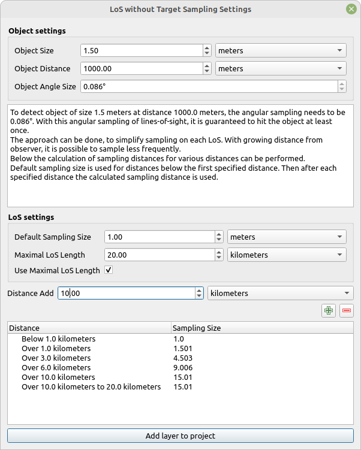

# LoS without Target Sampling Settings

This tool provides interactive interface to specify how distance sampling on LoS without target should be done. It is an interactive counter part to tools: [Calculate Object Detection Angle](../tools/Calculate Parameters Settings/tool_angle_at_distance_for_size.md), [Calculate Object Distances](../tools/Calculate Parameters Settings/tool_distances_for_sizes.md) and [Calculate Object Sizes](../tools/Calculate Parameters Settings/tool_sizes_at_distances.md).

The output of this tool is a tabular layer, that can be used as a `Sampling distance - distance table` input in [Create No Target LoS V2](../tools/LoS%20Creation/tool_create_notarget_los_v2.md).

This tool summarizes the parameters and the output in more informative manner and allows user to specify the parameters interactively.

The output and changes from this tool are propagated to the plugin, where they are stored and made available to other interactive tools.

## Tool screenshot

