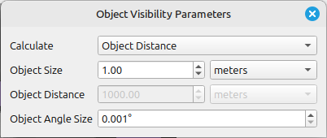

# Object Visibility Parameters

This tool allows the calculation of visibility parameters for objects in the scene. It enables the determination of one parameter — object size, object distance, or object angular size — based on the other two variables.

## Tool screenshot

