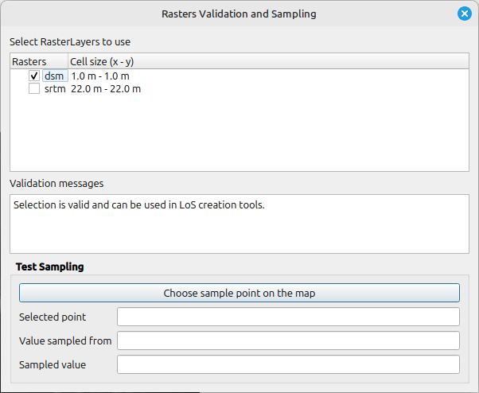

# Rasters Validation and Sampling

This tool allows testing of raster selection for LoS creation tools. The tool allows selection of Raster Layers from current QGIS project, performs set of validations that are also done by LoS creation tools and shows text output.

It is also possible to test sampling from the list of selected rasters to find out value at specific point and find out from which Raster Layer the value was sampled.

The output and changes from this tool are propagated to the plugin, where they are stored and made available to other interactive tools.

## Tool screenshot

