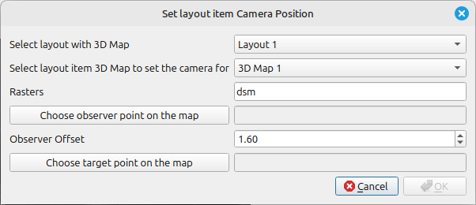

# Set Camera to Layout 3D Map

This tool sets up camera for 3D Map layout item to specific point on a raster looking towards specified target point. This allows rendering the 3D Map for specific viewer.

## Parameters

| Label                                           | Type           | Description                                                                               |
| ----------------------------------------------- | -------------- | ----------------------------------------------------------------------------------------- |
| Select Layout with 3D map                       | [layout]       | A layout.                                                                                 |
| Select layout item 3D Map to set the camera for | [3dLayoutItem] | Layout item with 3D view.                                                                 |
| Rasters                                         |                | List of rasters that will be used to extract elevation. (not editable - only informative) |
| Observer offset above raster                    | [number]       | Elevation offset from the selected raster.                                                |
| Choose observer point on the map                | [point]        | Point from the map (if snapping is enabled the tool honors the settings).                 |
| Choose target point on the map                  | [point]        | Point from the map (if snapping is enabled the tool honors the settings).                 |

## Tool screenshot

