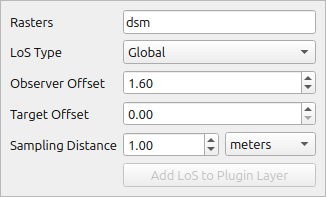
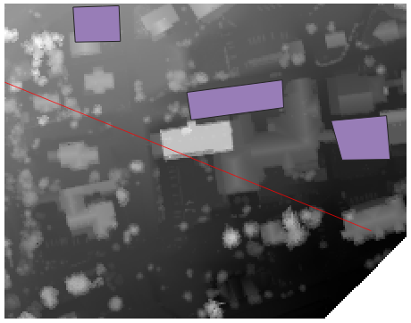

# Create LoS

This tool enables the interactive creation of Lines of Sight (LoS), either local or global. It samples elevation data based on the configuration specified in [Rasters Validation and Sampling](dialog_raster_validations.md). The created LoS can be added to the LoS layer from the plugin and subsequently included in the QGIS project.

The tool uses QGIS settings for snapping. By turning snapping on in QGIS, it makes easier to precisely select observation point based on existing layer points.

## Tool screenshot

Tool's interactive widget to specify settings.

Tool result on Map Canvas.

