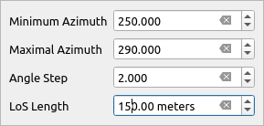
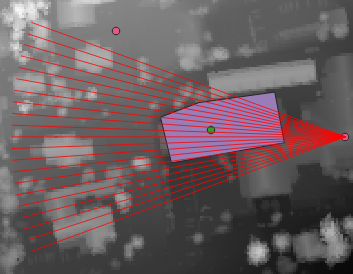

# Visualize LoS No Target Tool

This tool allows testing of No Target LoS Settings in the form of interactive map tool. The user specifies observing point from the map canvas and based on the settings specified in an interactive widget (similar to settings of tool [Create points around](../tools/Points Creation/tool_points_around.md), the lines of sight get drawn as temporary graphic on the canvas. Allowing the user to verify direction, length and density of lines-of-sight.

The tool uses QGIS settings for snapping. By turning snapping on in QGIS, it makes easier to precisely select observation point based on existing layer points.

## Tool screenshot

Tool's interactive widget to specify settings.

Tool result on Map Canvas.

