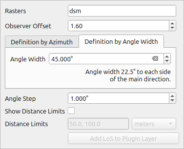

# Create LoS No Target Tool

This tool allows the creation of No Target LoS settings using an interactive map tool. Two approaches are available for the user:

1. Specify the observer point and create No Target LoS by defining azimuth limits.
2. Interactively select the observer point and the main direction of No Target LoS with a specified angle difference from the main direction.

It is also possible to visualize distance limits of the No Target LoS on the map.

The tool samples elevation data based on the configuration specified in [Rasters Validation and Sampling](dialog_raster_validations.md), and the LoS sampling distances are obtained from [LoS without Target Sampling Settings](dialog_los_without_target_sampling_settings.md). The created LoS can be added to the LoS layer from the plugin and subsequently included in the QGIS project.

The tool uses QGIS settings for snapping. By turning snapping on in QGIS, it makes easier to precisely select observation point based on existing layer points.

## Tool screenshot

Tool's interactive widget to specify settings.

### Creation by observer point and azimuth limits

Tool result on Map Canvas.

### Creation by observer point and direction with angle difference

Tool result on Map Canvas.

