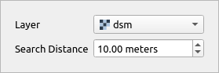
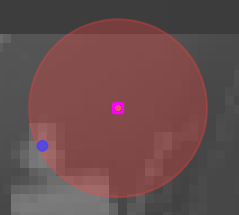

# Optimize Point Location Tool

This tool is an interactive version of [Optimize Point Location](../tools/Points%20Creation/tool_optimize_point_location.md).

The tool can only be activated if QGIS active layer is a **Point layer** with **projected CRS** and **editing turned on**.

Through interactive input widget user can specify raster layer to be used as optimization layer and search distance for higher values.

Upon selection the tools displays search distance radius as a red circle and a possible optimized point as a blue dot. The tool does not use QGIS snapping settings, instead of that it always uses custom snapping on the edited layer. If the user clicks when point is selected and optimized location is suggested the point is moved to the new location. This edit can be undone as normal QGIS layer editing.

## Tool screenshot

Tool's interactive widget to specify settings.

Tool on Map Canvas, showing the selected point (pink rectangle), search radius (red circle) and optimized location (blue dot).

