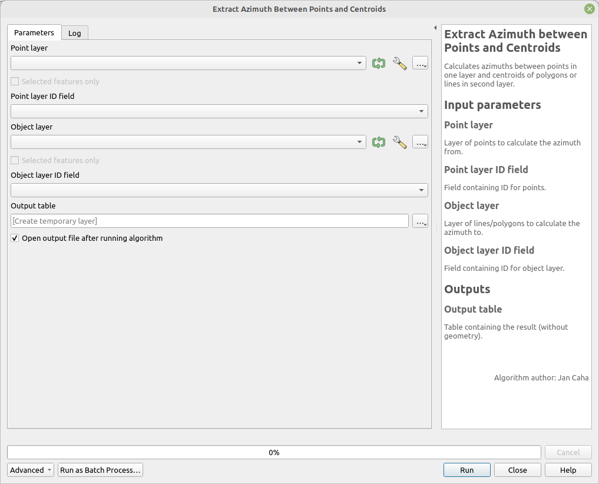

# Extract Azimuth between Points and centroids of Polygons/Lines

Calculates azimuth between points in one layer and centroids of polygons or lines in second layer.

## Parameters

| Label | Name | Type | Description |
| --- | --- | --- | --- |
| Point layer | `PointLayer` | [vector: point] | Layer of points to calculate the azimuth from. |
| Point layer ID field | `PointLayerID` | [tablefield: numeric] | Field containing ID for points. |
| Object layer | `ObjectLayer` | [vector: line, polygon]  | Layer of lines/polygons to calculate the azimuth to. |
| Object layer ID field | `ObjectLayerID` | [table]  | Field containing ID for object layer. |
| Output table | `OutputTable` | [table]  | Table containing the result (without geometry). |

## Outputs

| Label | Name | Type | Description |
| --- | --- | --- | --- |
| Output table | `OutputTable` | [table]  | Table containing the result (without geometry). |

For $n$ points and $m$ lines/polygons the output layer will have $n \times m$ rows.

### Fields in the output layer

* __id_point__ - integer - value from expected field (`PointLayerID`) in `PointLayer`
* __id_object__ - integer - value from expected field (`ObjectLayerID`) in `ObjectLayerID`
* __azimuth__ - double - azimuth from given point to the centroid of given line/polygon

## Tool screenshot

	