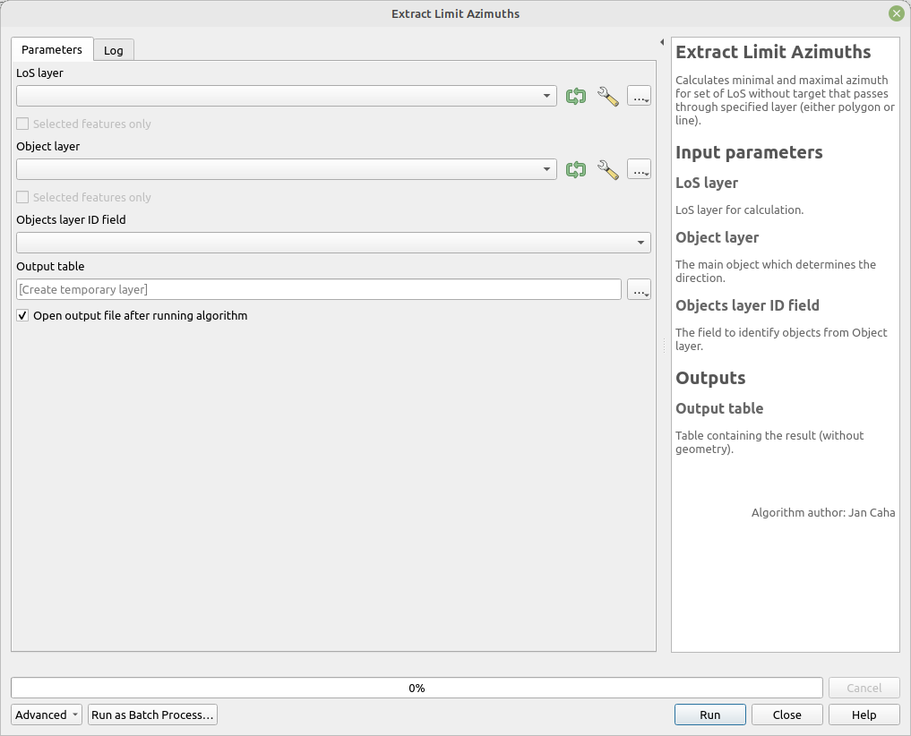

# Extract Limit Angles

Calculates minimal and maximal azimuth for set of LoS without target that passes through specified layer (either polygon or line).

## Parameters

| Label | Name | Type | Description |
| --- | --- | --- | --- |
| LoS layer | `LoSLayer` | [vector: line] | LoS layer for calculation. |
| Object layer | `ObjectLayer` | [vector: line, polygon] | The main object which determines the direction. |
| Output table | `OutputTable` | [table]  | Table containing the result (without geometry). |

## Outputs

| Label | Name | Type | Description |
| --- | --- | --- | --- |
| Output table | `OutputTable` | [table]  | Table containing the result (without geometry). |

### Fields in the output layer

* __id_observer__ - integer - value from expected field (`id_observer`) in `LoSLayer`
* __minimal_azimuth__ - double - minimal azimuth LoS for given observer that passes by geometry in `ObjectLayer`
* __maximal_azimuth__ - double - maximal azimuth LoS for given observer that passes by geometry in `ObjectLayer`

## Tool screenshot

	