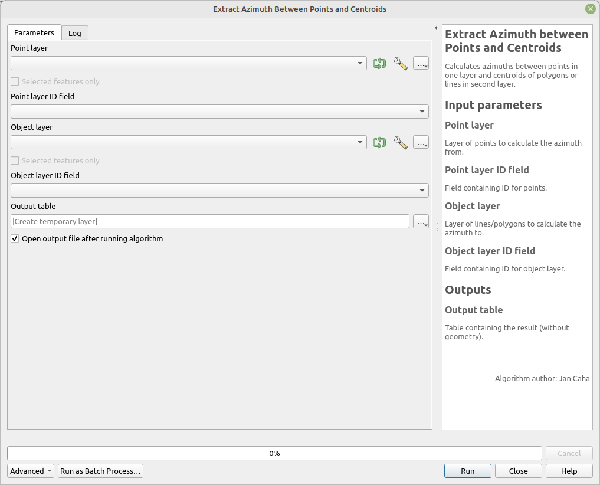

# Extract Azimuth between Points and Centroids

Calculates azimuths between points in one layer and the centroids of polygons or lines in a second layer.

## Parameters

| Label                 | Name            | Type                    | Description                                                |
| --------------------- | --------------- | ----------------------- | ---------------------------------------------------------- |
| Point layer           | `PointLayer`    | [vector: point]         | Layer of points from which to calculate the azimuth.       |
| Point layer ID field  | `PointLayerID`  | [tablefield: numeric]   | Field containing IDs for the points.                       |
| Object layer          | `ObjectLayer`   | [vector: line, polygon] | Layer of lines/polygons to which to calculate the azimuth. |
| Object layer ID field | `ObjectLayerID` | [tablefield: numeric]   | Field containing IDs for the object layer.                 |
| Output table          | `OutputTable`   | [table]                 | Table containing the results (without geometry).           |

## Outputs

| Label        | Name          | Type    | Description                                      |
| ------------ | ------------- | ------- | ------------------------------------------------ |
| Output table | `OutputTable` | [table] | Table containing the results (without geometry). |

For $n$ points and $m$ lines/polygons the output layer will have $n \times m$ rows.

### Fields in the output layer

* __id_point__ - integer - value from expected field (`PointLayerID`) in `PointLayer`
* __id_object__ - integer - value from expected field (`ObjectLayerID`) in `ObjectLayerID`
* __azimuth__ - double - azimuth from given point to the centroid of given line/polygon

## Tool screenshot

