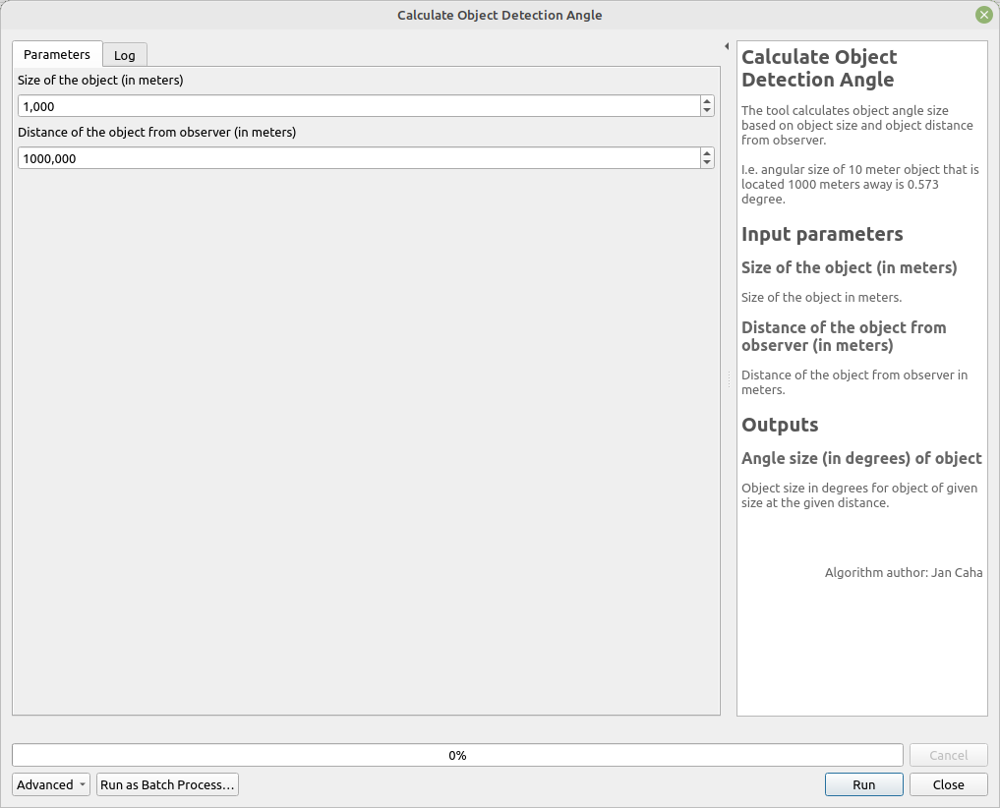

# Calculate Object Detection Angle

This tool calculates the angular size of an object based on its physical size and its distance from the observer.

For example, the angular size of a 10-meter object located 1000 meters away is 0.573 degrees.

## Parameters

| Label                                            | Name          | Type                                     | Description                                                            |
| ------------------------------------------------ | ------------- | ---------------------------------------- | ---------------------------------------------------------------------- |
| Size of the object (in meters)                   | `Size`        | [number]   Default:   `1.0`  | Size of the object in meters.                                          |
| Distance of the object from observer (in meters) | `Distance`    | [number]   Default:   `1000` | Distance of the object from the observer in meters.                    |  |
| Angle size (in degrees) of object                | `OutputAngle` | [number]                                 | Angular size of the object in degrees for the given size and distance. |

## Outputs

| Label                             | Name          | Type     | Description                                                            |
| --------------------------------- | ------------- | -------- | ---------------------------------------------------------------------- |
| Angle size (in degrees) of object | `OutputAngle` | [number] | Angular size of the object in degrees for the given size and distance. |

## Tool screenshot

