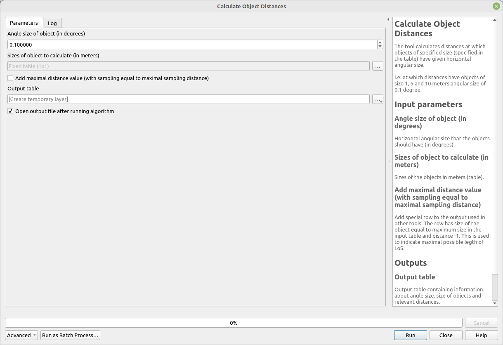

# Calculate Object Distances

The tool calculates distances at which objects of specified size (specified in the table) have given horizontal angular size.

I.e. at which distances will object of size 1, 5 and 10 meters be detected when the angular size of 0.1 degree is set?

To be usable in other plugin tools, there is a necessary parameter to be set maximal distance. It special row into the output table so that it can be later correctly processed.
	

## Parameters

| Label                                                                         | Name              | Type                                    | Description                                                                                                                                                                                         |
| ----------------------------------------------------------------------------- | ----------------- | --------------------------------------- | --------------------------------------------------------------------------------------------------------------------------------------------------------------------------------------------------- |
| Angle size of object (in degrees)                                             | `Angle`           | [number]   Default:   `0.1` | Horizontal angular size that the objects should have (in degrees).                                                                                                                                  |
| Sizes of object to calculate (in meters)                                      | `Size`            | [matrix]                                | Sizes of the objects in meters (table).                                                                                                                                                             |  |
| Add maximal distance value (with sampling equal to maximal sampling distance) | `MaximalDistance` | [boolean]  Default: `True`      | Add special row to the output used in other tools. The row has size of the object equal to maximum size in the input table and distance -1. This is used to indicate maximal possible legth of LoS. |
| Output table                                                                  | `OutputTable`     | [table]                                 | Output table containing information about angle size, size of objects and relevant distances (without geometry).                                                                                    |

## Outputs

| Label        | Name          | Type    | Description                                                                                                      |
| ------------ | ------------- | ------- | ---------------------------------------------------------------------------------------------------------------- |
| Output table | `OutputTable` | [table] | Output table containing information about angle size, size of objects and relevant distances (without geometry). |

### Fields in the output layer

* __Object size (angle)__ - integer - value from expected field (`PointLayerID`) in `PointLayer`
* __Distance (meters)__ - integer - value from expected field (`ObjectLayerID`) in `ObjectLayerID`
* __Size of objects (meters)__ - double - azimuth from given point to the centroid of given line/polygon

## Tool screenshot

