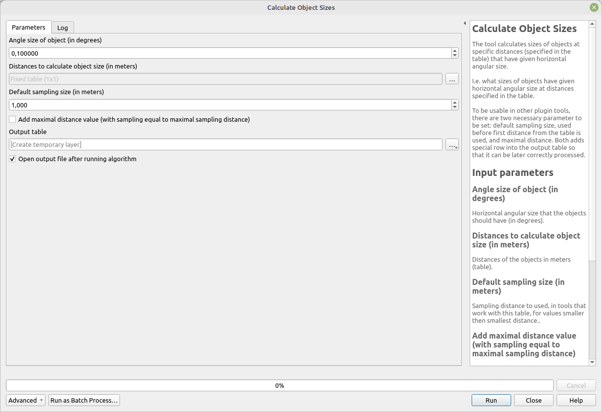

# Calculate Object Sizes

The tool calculates sizes of objects at specific distances (specified in the table) that have given horizontal angular size.

I.e. what sizes of objects have given horizontal angular size at distances specified in the table.

To be usable in other plugin tools, there are two necessary parameters to be set: default sampling size, used before first distance from the table is used, and maximal distance. Both add a special row into the output table so that it can be later correctly processed.
	
`Default sampling size` parameter specifies default size of object used for values of distance smaller than smallest value in `Distance`. This is necessary for further processing of output table. For example, for angular size of 0.1 degree and distance 1000 meters the size is 1.745 meter. For LoS sampling we know that to detect object of angular size 0.1 at 1 km the sampling distance can be 1.745 meter. However, sampling distance for values in distance range 0 - 1000 meter need to be specified. This is done by this parameter. 

## Parameters

| Label                                                                         | Name                      | Type                                    | Description                                                                                                                                                                                                                                  |
| ----------------------------------------------------------------------------- | ------------------------- | --------------------------------------- | -------------------------------------------------------------------------------------------------------------------------------------------------------------------------------------------------------------------------------------------- |
| Angle size of object (in degrees)                                             | `Angle`                   | [number]   Default:   `0.1` | Horizontal angular size that the objects should have (in degrees).                                                                                                                                                                           |
| Distances to calculate object size (in meters)                                | `Distance`                | [matrix]                                | Distances of the objects in meters (table).                                                                                                                                                                                                  |
| Default sampling size (in meters)                                             | `DefaultSamplingDistance` | [number]   Default:   `1.0` | Sampling distance to be used in tools that work with this table for values smaller than the smallest distance.                                                                                                                               |
| Add maximal distance value (with sampling equal to maximal sampling distance) | `MaximalDistance`         | [boolean]  Default: `True`      | Adds a special row to the output used in other tools. The row has the size of the object equal to the maximum size in the input table and a distance of -1. This is used to indicate the maximal possible length of the line of sight (LoS). |
| Output table                                                                  | `OutputTable`             | [table]                                 | Output table containing information about the angle size, size of objects, and relevant distances.                                                                                                                                           |

## Outputs

| Label        | Name          | Type    | Description                                                                                        |
| ------------ | ------------- | ------- | -------------------------------------------------------------------------------------------------- |
| Output table | `OutputTable` | [table] | Output table containing information about the angle size, size of objects, and relevant distances. |

### Fields in the output layer

* __Object size (angle)__ - integer - value from expected field (`PointLayerID`) in `PointLayer`
* __Distance (meters)__ - integer - value from expected field (`ObjectLayerID`) in `ObjectLayerID`
* __Size of objects (meters)__ - double - azimuth from given point to the centroid of given line/polygon

## Tool screenshot

