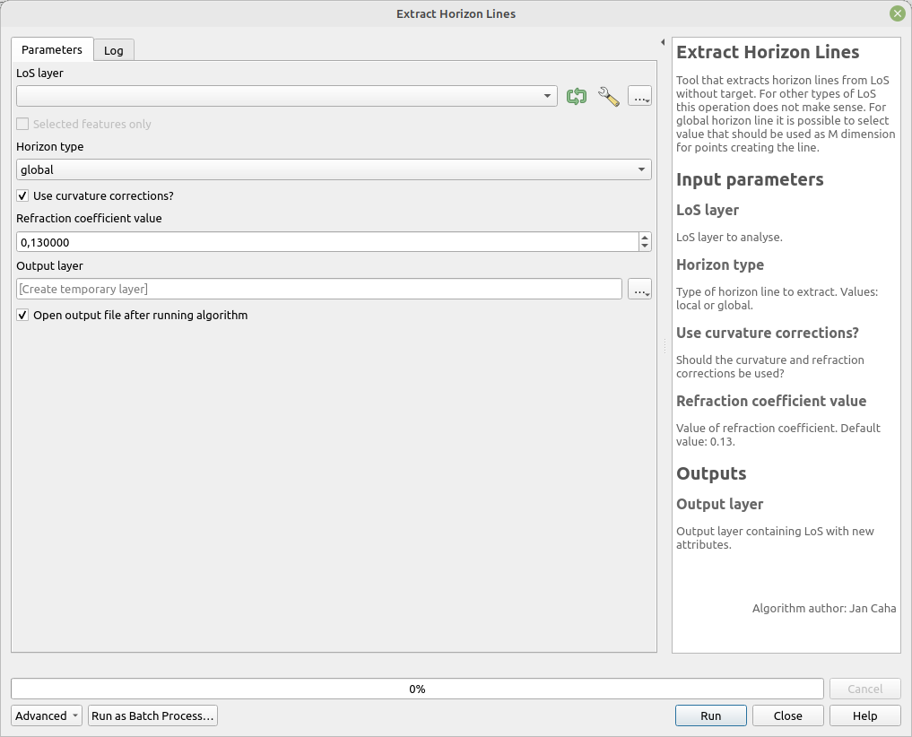

# Export Horizon Lines Layer to table

Export horizon lines layer (or only selected features) to table suitable for export outside of QGIS. In the output table every row is a single point on specific LoS. 

## Parameters

| Label               | Name                | Type           | Description                                         |
| ------------------- | ------------------- | -------------- | --------------------------------------------------- |
| Horizon Lines Layer | `HorizonLinesLayer` | [vector: line] | Horizon lines layer to export.                      |
| Output file         | `OutputFile`        | [table]        | Output containing exported points of horizon lines. |

## Outputs

| Label       | Name         | Type    | Description                                         |
| ----------- | ------------ | ------- | --------------------------------------------------- |
| Output file | `OutputFile` | [table] | Output containing exported points of horizon lines. |

### Fields in the output layer

There are universal fields for all types of horizons. There are some additional fields that are specific to specific horizon types. 

* __id_observer__ - integer - value from field `id_observer`
* __horizon_type__ - string - type of horizon (local/global)
* __horizontal_angle__ - double - horizontal angle (azimuth) from observer to the point
* __viewing_angle__ - double - vertical viewing angle from observer to the point
* __horizon_distance__ - double - distance of the horizon point from observer

#### Global horizon

* __angle_difference_to_local_horizon__ - double - angle difference to previous local horizon
* __elevation_difference_to_local_horizon__ - double - elevation difference to previous local horizon

## Tool screenshot

	