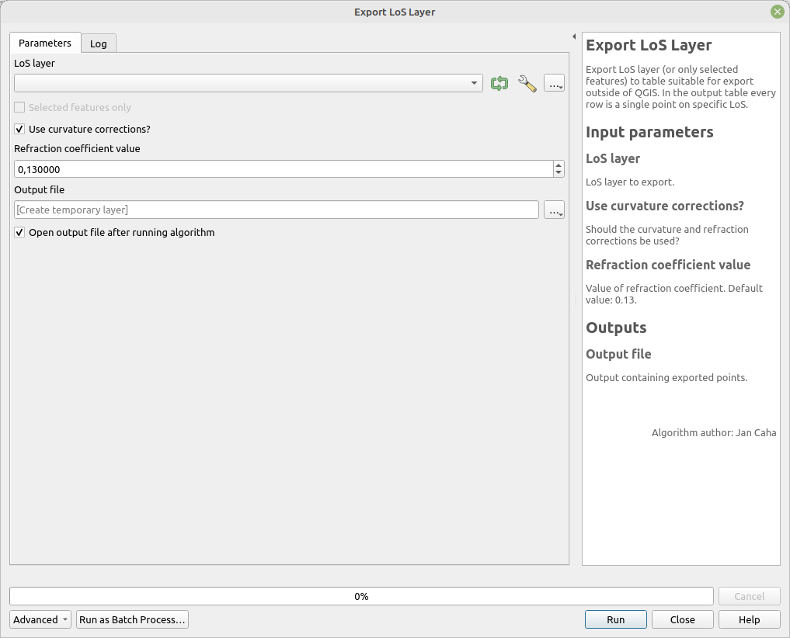

# Export LoS Layer to table

Exports the LoS layer (or only selected features) to a table suitable for export outside of QGIS. In the output table, each row represents a single point on a specific LoS.

## Parameters

| Label                        | Name                    | Type                                      | Description                                             |
| ---------------------------- | ----------------------- | ----------------------------------------- | ------------------------------------------------------- |
| LoS layer                    | `LoSLayer`              | [vector: line]                            | LoS layer to export.                                    |
| Use curvature corrections?   | `CurvatureCorrections`  | [boolean]  Default: `True`        | Should curvature and refraction corrections be applied? |
| Refraction coefficient value | `RefractionCoefficient` | [number]    Default:   `0.13` | Value of the refraction coefficient.                    |
| Output file                  | `OutputFile`            | [table]                                   | Output file containing exported points.                 |

## Outputs

| Label       | Name         | Type    | Description                             |
| ----------- | ------------ | ------- | --------------------------------------- |
| Output file | `OutputFile` | [table] | Output file containing exported points. |

### Fields in the output layer

There are universal fields for all types of LoS. There are some additional fields that are specific to LoS types. 

* __id_los__ - string - unique identifier of LoS
* __id_observer__ - integer - value from field `id_observer`
* __observer_offset__ - double - value from the field `observer_offset`
* __distance_from_observer__ - double - distance of the point from observer
* __elevation__ - double - elevation of point from DEM
* __visible__ - boolean - is the point visible?
* __horizon__ - boolean - is the point horizon?

#### LoS local

* __id_target__ - integer - value from field `id_target`
* __target_offset__ - double - value from field `target_offset`

#### LoS global

* __id_target__ - integer - value from field `id_target`
* __target_offset__ - double - value from field `target_offset`
* __target_x__ - double - X coordinate from field `target_x`
* __target_y__ - double - Y coordinate from field `target_y`
* __target__ - boolean - is this point a target point?

## Tool screenshot

	