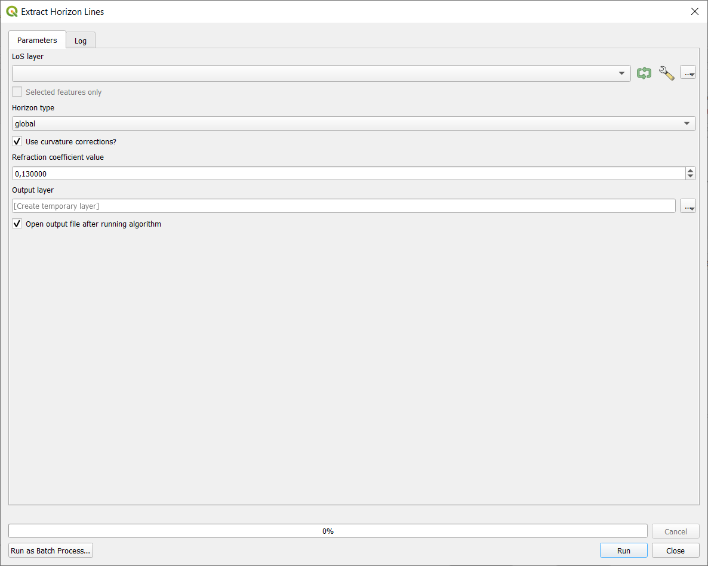

# Extract Horizon Lines

Tool that extracts horizon lines from LoS without target (created using tool [Create no target LoS](../LoS Creation/tool_create_notarget_los.md). For other types of LoS this operation does not make sense.

## Parameters

| Label | Name | Type | Description |
| --- | --- | --- | --- |
| LoS layer | `LoSLayer` | [vector: line] | LoS layer to analyse. |
| Horizon type | `HorizonType` | [enumeration]    Default:   `1` | Type of horizon line to extract.    **Values**:   **0** - maximal local   **1** - global |
| Output layer | `OutputLayer` | [vector: line] | Output layer horizon lines. |
| Use curvature corrections? | `CurvatureCorrections` | [boolean]  Default: `True` | Should the curvarture and refraction corrections be used? |
| Refraction coefficient value | `RefractionCoefficient` | [number]    Default:   `0.13` | Value of refraction coefficient. |

## Outputs

| Label | Name | Type | Description |
| --- | --- | --- | --- |
| Output layer | `OutputLayer` | [vector: line] | Output layer horizon lines. |

### Fields in the output layer

* __horizon_type__ - string - type of extracted horizon line
* __id_observer__ - integer - value from expected field (`id_observer`) in `LoSLayer`
* __observer_x__ - double - X coordinate of observer point, to be used later in analyses
* __observer_y__ - double - Y coordinate of observer point, to be used later in analyses

Further fields depend on type of horizon lines that are extracted.

#### Global horizon lines

* __angle_difference_global_to_local_horizon__ - double
* __elevation_difference_global_to_local_horizon__ - double
* __distance_global_horizon__ - double

## Tool screenshot

	