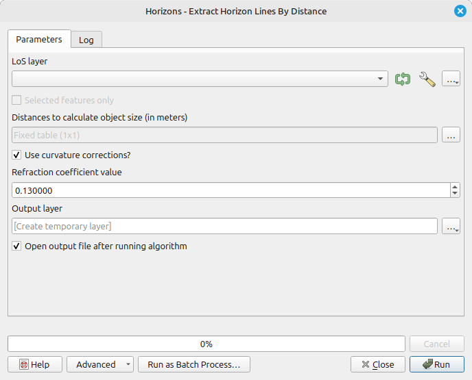

# Extract Horizon Lines

Tool that extracts horizon lines from LoS without target (created using tool [Create no target LoS](../LoS Creation/tool_create_notarget_los.md)). For other types of LoS this operation does not make sense.

The horizon lines are extracted for a set of distances from the observer. The distances are provided in the table. The horizon line is extracted for each observer and distance separately, only horizons that are closer to the observer than the given distance are consider for each horizon line.

## Parameters

| Label                             | Name                    | Type                                      | Description                                                           |
| --------------------------------- | ----------------------- | ----------------------------------------- | --------------------------------------------------------------------- |
| LoS layer                         | `LoSLayer`              | [vector: line]                            | LoS layer to analyse.                                                 |
| Distance limits for horizon lines | `Distances`             | [matrix]                                  | Table of distance limits for which horizon lines should be extracted. |
| Output layer                      | `OutputLayer`           | [vector: line]                            | Output layer horizon lines.                                           |
| Use curvature corrections?        | `CurvatureCorrections`  | [boolean]  Default: `True`        | Should the curvarture and refraction corrections be used?             |
| Refraction coefficient value      | `RefractionCoefficient` | [number]    Default:   `0.13` | Value of refraction coefficient.                                      |

## Outputs

| Label        | Name          | Type           | Description                 |
| ------------ | ------------- | -------------- | --------------------------- |
| Output layer | `OutputLayer` | [vector: line] | Output layer horizon lines. |

### Fields in the output layer

* __horizon_distance__ - double - maximal distance of the horizon line from observer
* __id_observer__ - integer - value from expected field (`id_observer`) in `LoSLayer`
* __observer_x__ - double - X coordinate of observer point, to be used later in analyses
* __observer_y__ - double - Y coordinate of observer point, to be used later in analyses

## Tool screenshot

