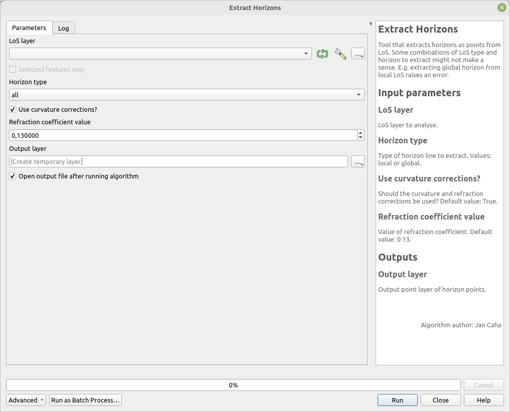

# Extract Horizons

This tool extracts horizons as points from LoS. Some combinations of LoS type and horizon to extract might not make sense. For example, extracting a global horizon from a local LoS raises an error.

## Parameters

| Label                        | Name                    | Type                                        | Description                                                                                        |
| ---------------------------- | ----------------------- | ------------------------------------------- | -------------------------------------------------------------------------------------------------- |
| LoS layer                    | `LoSLayer`              | [vector: line]                              | LoS layer to analyze.                                                                              |
| Horizon type                 | `HorizonType`           | [enumeration]    Default:   `1` | Type of horizon line to extract.     **Values**:   **0** - local   **1** - global. |
| Output layer                 | `OutputLayer`           | [vector: point]                             | Output layer of horizon points.                                                                    |
| Use curvature corrections?   | `CurvatureCorrections`  | [boolean]  Default: `True`          | Should curvature and refraction corrections be applied?                                            |
| Refraction coefficient value | `RefractionCoefficient` | [number]    Default:   `0.13`   | Value of the refraction coefficient.                                                               |
| Output layer                 | `OutputLayer`           | [vector: point]                             | Output point layer of horizon points.                                                              |

## Outputs

| Label        | Name          | Type            | Description                           |
| ------------ | ------------- | --------------- | ------------------------------------- |
| Output layer | `OutputLayer` | [vector: point] | Output point layer of horizon points. |

### Fields in the output layer

* __horizon_type__ - string - type of extracted horizon
* __id_observer__ - integer - value from expected field (`id_observer`) in `LoSLayer`
* __id_target__ - integer - value from expected field (`id_target`) in `LoSLayer`

#### LoS without target

* __azimuth__ - double

## Tool screenshot

	