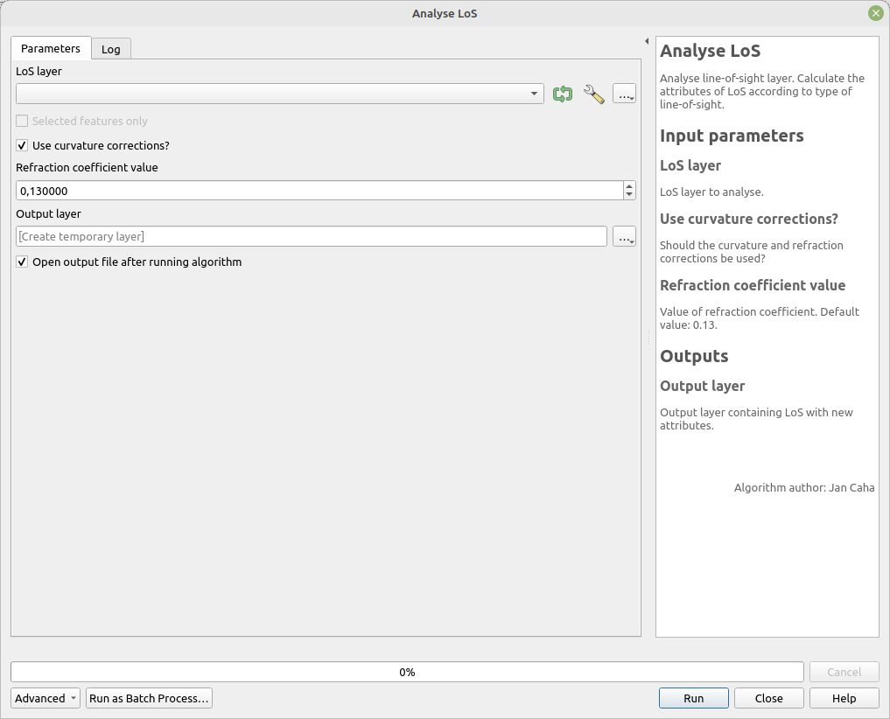

# Analyse LoS

Analyse line-of-sight layer. Calculate the attributes according to type of line-of-sight (see Outputs).

## Parameters

| Label | Name | Type | Description |
| --- | --- | --- | --- |
| LoS layer | `LoSLayer` | [vector: line] | LoS layer to analyse. |
| Use curvature corrections? | `CurvatureCorrections` | [boolean]  Default: `True` | Should the curvarture and refraction corrections be used? |
| Refraction coefficient value | `RefractionCoefficient` | [number]    Default:   `0.13` | Value of refraction coefficient. |
| Output layer | `OutputLayer` | [vector: line] | Output layer containing LoS with new attributes. |

## Outputs

| Label | Name | Type | Description |
| --- | --- | --- | --- |
| Output layer | `OutputLayer` | [vector: line] | Output layer containing LoS with new attributes. |

### LoS local

* __visible__ - boolean
* __viewing_angle__ - double
* __elevation_difference__ - double
* __angle_difference_local_horizon__ - double
* __elevation_difference_local_horizon__ - double
* __los_slope_difference_local_horizon__ - double
* __horizon_count__ - integer
* __local_horizon_distance__ - double

### LoS global

* __visible__ - boolean
* __angle_difference_global_horizon__ - double
* __elevation_difference_global_horizon__ - double
* __horizon_count_behind_target__ - integer
* __global_horizon_distance__ - double

### LoS without target

* __maximal_vertical_angle__ - double
* __global_horizon_distance__ - double
* __local_horizon_distance__ - double
* __vertical_angle_local_horizon__ - double

## Tool screenshot

	