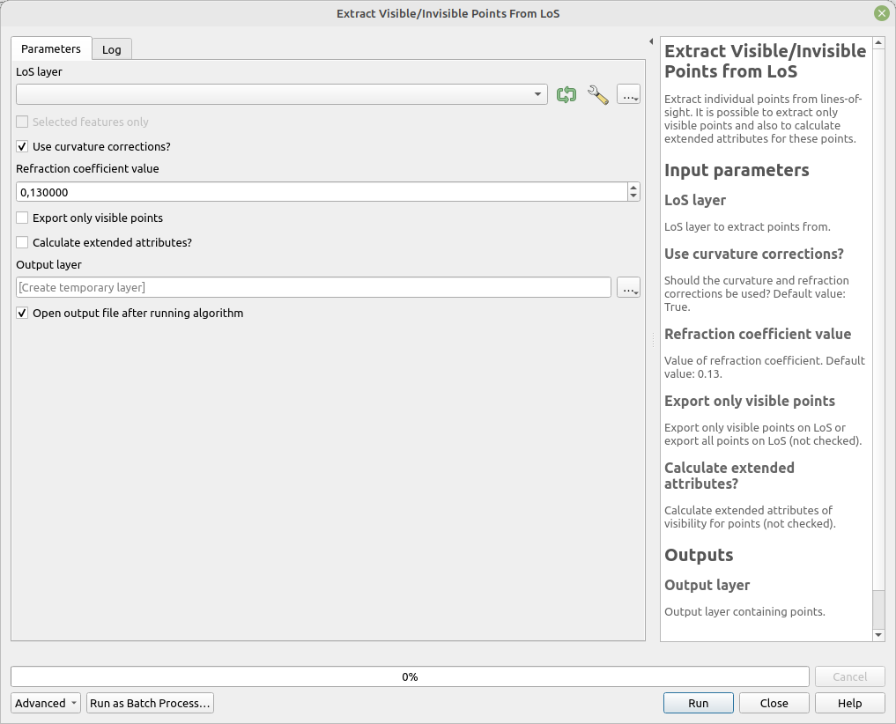

# Extract Points from LoS

Extract individual points from lines-of-sight. It is possible to extract only visible points and also to calculate extended attributes for these points.

## Parameters

| Label | Name | Type | Description |
| --- | --- | --- | --- |
| LoS layer | `LoSLayer` | [vector: line] | LoS layer to extract points from. |
| Use curvature corrections? | `CurvatureCorrections` | [boolean]  Default: `True` | Should the curvarture and refraction corrections be used? |
| Refraction coefficient value | `RefractionCoefficient` | [number]    Default:   `0.13` | Value of refraction coefficient. |
| Export only visible points | `OnlyVisiblePoints` | [boolean]  Default: `False` | Export only visible points on LoS or export all points on LoS (not checked). |
| Calculate extended attributes | `ExtendedAttributes` | [boolean]  Default: `False` | Calculate extended attributes for points (not checked). |
| Output layer | `OutputLayer` | [vector: point] | Output layer containing points. |

## Outputs

| Label | Name | Type | Description |
| --- | --- | --- | --- |
| Output layer | `OutputLayer` | [vector: point] | Output layer containing points. |

### Fields in the output layer

* __id_observer__ - integer - value from expected field (`id_observer`) in `LoSLayer`
* __id_target__ - integer - value from expected field (`id_target`) in `LoSLayer`
* __visible__ - boolean - is the point visible

### Additional fields if `Calculate extended attributes` is `True`

Calculation of these attributes can potentially significantly slow down the calculation.  

For all types of LoS:

* __angle_difference_local_horizon__ - double
* __elevation_difference_local_horizon__ - double

For Global and NoTarget LoS:

* __angle_difference_global_horizon__ - double
* __elevation_difference_global_horizon__ - double

## Tool screenshot

	