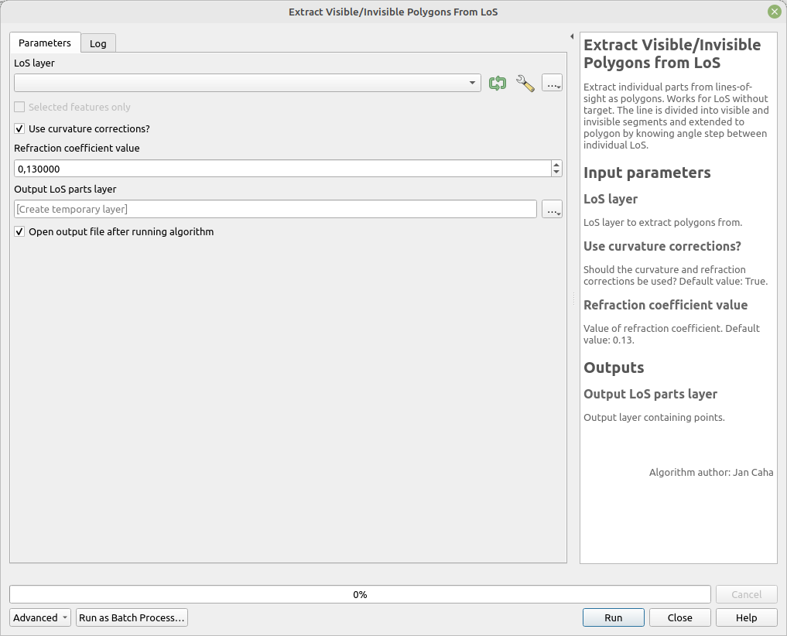

# Extract Visible/Invisible Polygons from LoS

Extracts individual parts from lines-of-sight as polygons. Works for LoS without a target. The line is divided into visible and invisible segments and extended to polygons by knowing the angle step between individual LoS.

## Parameters

| Label                        | Name                    | Type                                      | Description                                             |
| ---------------------------- | ----------------------- | ----------------------------------------- | ------------------------------------------------------- |
| LoS layer                    | `LoSLayer`              | [vector: line]                            | LoS layer to extract polygons from.                     |
| Use curvature corrections?   | `CurvatureCorrections`  | [boolean]  Default: `True`        | Should curvature and refraction corrections be applied? |
| Refraction coefficient value | `RefractionCoefficient` | [number]    Default:   `0.13` | Value of the refraction coefficient.                    |
| Output layer                 | `OutputLayer`           | [vector: point]                           | Output layer containing polygons.                       |

## Outputs

| Label        | Name          | Type            | Description                       |
| ------------ | ------------- | --------------- | --------------------------------- |
| Output layer | `OutputLayer` | [vector: point] | Output layer containing polygons. |

### Fields in the output layer

* __id_observer__ - integer - value from expected field (`id_observer`) in `LoSLayer`
* __id_target__ - integer - value from expected field (`id_target`) in `LoSLayer`
* __visible__ - boolean - is the point visible

## Tool screenshot

	