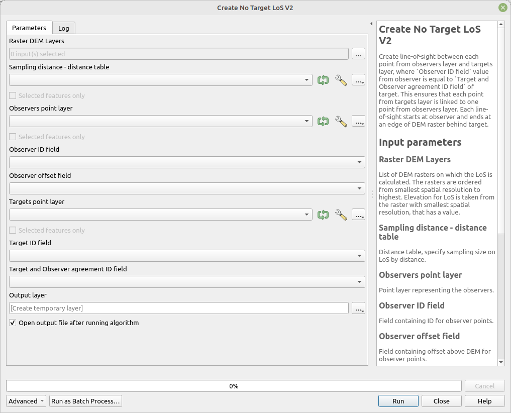

# Create no target LoS

Create line-of-sight between each point from observers layer and targets layer, where `Observer ID field` value from observer is equal to `Target and Observer agreement ID field` of target. This ensures that each point from targets layer is linked to one point from observers layer. Each line-of-sight starts at observer and ends at an edge of DEM raster behind target.

The target points can be and usually should be created by tools [Create points around](../Points Creation/tool_points_around.md) and [Create points in direction](../Points Creation/tool_points_in_direction.md).

## Parameters

| Label | Name | Type | Description |
| --- | --- | --- | --- |
| Raster Layer DEM | `DemRaster` | [raster] | Raster DEM on which the LoS is calculated. |
| Observers point layer | `ObserverPoints` | [vector: point] | Point layer representing the observers. |
| Observer ID field | `ObserverIdField` | [tablefield: numeric] | Field containing ID for observer points. |
| Observer offset field | `ObserverOffset` | [tablefield: numeric] | Field containing offset above DEM for observer points. |
| Targets point layer | `TargetPoints` | [vector: point] | Point layer representing the targets. |
| Target ID field | `TargetIdField` | [tablefield: numeric] | Field containing ID for target points. |
| Target and Observer agreement ID field | `TargetDefinitionIdField` | [tablefield: numeric] | Field that specifies which target point is linked to which observer point. Values in this field are compared to `ObserverIdField`. |
| LoS sampling distance | `LineDensity` | [distance]     Default:   `1` | The distance by which the LoS is segmentized. |
| Maximal length of LoS (0 means unlimited) | `MaxLoSLength` | [distance]     Default:   `0` | Maximal length of LoS generated. |
| Output layer | `OutputLayer` | [vector: line] | Output layer containing LoS. |

## Outputs

| Label | Name | Type | Description |
| --- | --- | --- | --- |
| Output layer | `OutputLayer` | [vector: line] | Output layer containing LoS. |

### Fields in the output layer

* __los_type__ - string - for this tool the values is always `without target`
* __id_observer__ - integer - value from field specified in `Observer ID field`
* __id_target__ - integer - value from field specified in `Target ID field`
* __observer_offset__ - double - double - value from the field specified in `Observer offset field`
* __azimuth__ - double - double - value from the field specified in `Target offset field`
* __target_x__ - double - X coordinate of point in `Targets point layer`, used later in analyses
* __target_y__ - double - Y coordinate of point in `Targets point layer`, used later in analyses

## Tool screenshot

	