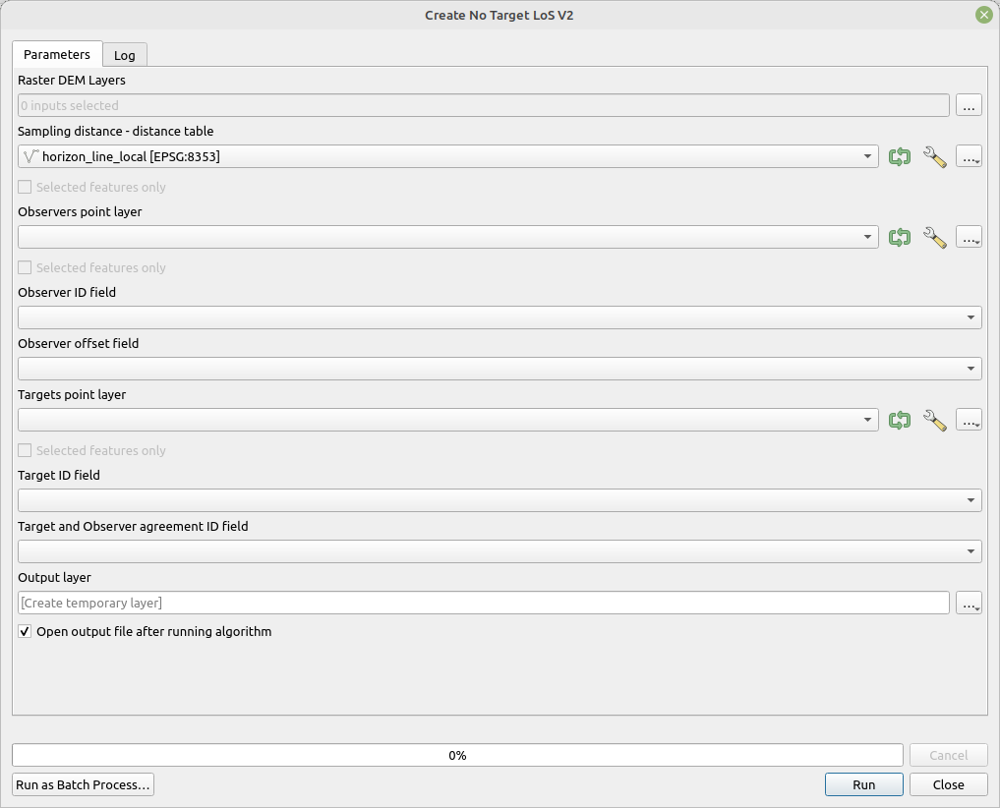

# Create no target LoS V2

Create line-of-sight between each point from observers layer and targets layer, where `Observer ID field` value from observer is equal to `Target and Observer agreement ID field` of target. This ensures that each point from targets layer is linked to one point from observers layer. Each line-of-sight starts at observer and ends at an edge of DEM raster behind target.

The target points can be and usually should be created by tools [Create points around](../Points Creation/tool_points_around.md) and [Create points in direction](../Points Creation/tool_points_in_direction.md).

This variant of the algorithm allows elevation extraction from multiple rasters. The rasters are ordered from smallest cell size to the biggest. Elevation is always obtained from raster with smallest cell size that has valid elevation value (no data is not considered as valid value). This allows utilization of DEM with large cells as addition to DEM with smaller cells. For example DEM with cell size 1 meter can be used within city for areas close to observers and SRTM data (30 meter cell size) in areas around the city, far from the observer.  

This variant of the tool specifies sampling and length of LoS by table `Sampling distance - distance table`. This a special kind of table, which can be output of tools ... fill in the tools and links ..., that specifies sampling distance and distance limits. Each row in the table specifies sampling distance (size) on LoS for distances lower then distance. Two rows with values of sizes 1 and 5 and distance 1000 and 3000 mean that LoS will be sampled every 1 meter for distance lower then 1000 meters and then each 5 meters for distances lower then 3000 meter from observer. The length of LoS will be limited to 3000 meters. To specify unlimited LoS length a row with distance value -1 and sampling distance must be present (this is interpreted as maximal possible length with respect to raster data).

## Parameters

| Label                                  | Name                      | Type                  | Description                                                                                                                        |
| -------------------------------------- | ------------------------- | --------------------- | ---------------------------------------------------------------------------------------------------------------------------------- |
| Raster Layer DEM                       | `DemRasters`              | [raster][list]        | Raster DEMs on which the LoS is calculated.                                                                                        |
| Sampling distance - distance table     | `LineSettingsTable`       | [vector: nogeometry]  | Distance table, specify sampling size on LoS by distance                                                                           |
| Observers point layer                  | `ObserverPoints`          | [vector: point]       | Point layer representing the observers.                                                                                            |
| Observer ID field                      | `ObserverIdField`         | [tablefield: numeric] | Field containing ID for observer points.                                                                                           |
| Observer offset field                  | `ObserverOffset`          | [tablefield: numeric] | Field containing offset above DEM for observer points.                                                                             |
| Targets point layer                    | `TargetPoints`            | [vector: point]       | Point layer representing the targets.                                                                                              |
| Target ID field                        | `TargetIdField`           | [tablefield: numeric] | Field containing ID for target points.                                                                                             |
| Target and Observer agreement ID field | `TargetDefinitionIdField` | [tablefield: numeric] | Field that specifies which target point is linked to which observer point. Values in this field are compared to `ObserverIdField`. |
| Output layer                           | `OutputLayer`             | [vector: line]        | Output layer containing LoS.                                                                                                       |

## Outputs

| Label        | Name          | Type           | Description                  |
| ------------ | ------------- | -------------- | ---------------------------- |
| Output layer | `OutputLayer` | [vector: line] | Output layer containing LoS. |

### Fields in the output layer

* __los_type__ - string - for this tool the values is always `without target`
* __id_observer__ - integer - value from field specified in `Observer ID field`
* __id_target__ - integer - value from field specified in `Target ID field`
* __observer_offset__ - double - double - value from the field specified in `Observer offset field`
* __azimuth__ - double - double - value from the field specified in `Target offset field`
* __target_x__ - double - X coordinate of point in `Targets point layer`, used later in analyses
* __target_y__ - double - Y coordinate of point in `Targets point layer`, used later in analyses
* __angle_step_between_los__ - double - difference between LoS from one viewpoint as angle (degrees)

## Tool screenshot

	