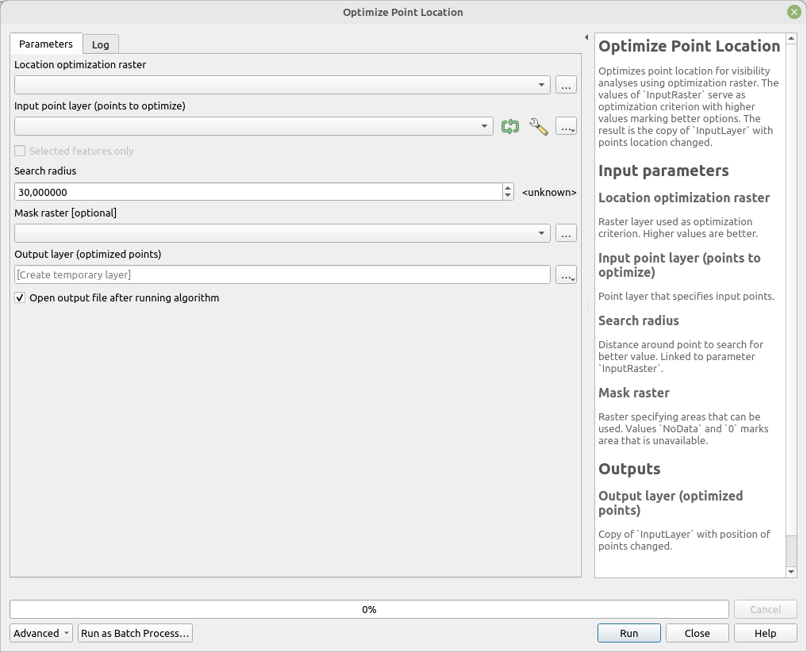

# Optimize Point Location

Optimizes point location for visibility analyses using optimization raster. The values of `InputRaster` serve as optimization criterion with higher values marking better options. The result is the copy of `InputLayer` with points location changed.

The optimization process is guided by two addition parameters - `Distance` and `MaskRaster`. `Distance` specifies distance around origin point to search for better values on `InputRaster` to move the point to. `MaskRaster` allows to optionally input raster that can move forbid some areas to be used as new point location. `MaskRaster` values `NoData` and `0` can be used to mark unavailable areas, other values can be used to place optimized points.

## Parameters

| Label                                  | Name          | Type                                    | Description                                                                                       |
| -------------------------------------- | ------------- | --------------------------------------- | ------------------------------------------------------------------------------------------------- |
| Location optimization raster           | `InputRaster` | [raster]                                | Raster layer used as optimization criterion. Higher values are better.                            |
| Input point layer (points to optimize) | `InputLayer`  | [vector: point]                         | Point layer that specifies input points.                                                          |
| Search radius                          | `Distance`    | [number]    Default:   `30` | Distance around point to search for better value. Linked to parameter `InputRaster`.              |
| Mask raster                            | `MaskRaster`  | [raster]                                | Raster specifying areas that can be used. Values `NoData` and `0` marks area that is unavailable. |
| Output layer (optimized points)        | `OutputLayer` | [vector: point]                         | Copy of `InputLayer` with position of points changed.                                             |

## Outputs

| Label                           | Name          | Type            | Description                                           |
| ------------------------------- | ------------- | --------------- | ----------------------------------------------------- |
| Output layer (optimized points) | `OutputLayer` | [vector: point] | Copy of `InputLayer` with position of points changed. |

### Fields in the output layer

The same as in `InputLayer`.

## Tool screenshot

	