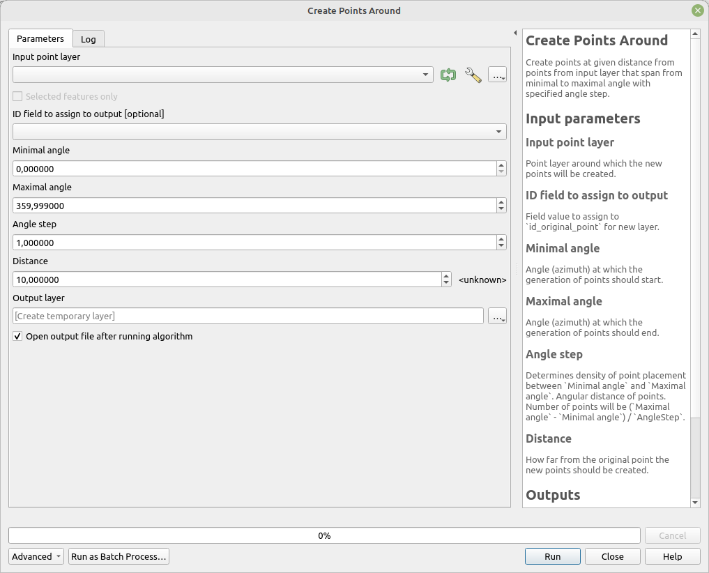

# Create Points Around

Create points at given distance from points from input layer that span from minimal to maximal angle with specified angle step.

The default values create points from angle 0 (north) to angle 359 (almost north) by one 1 degree, which means 360 points (one point per degree).

## Parameters

| Label                        | Name          | Type                                     | Description                                                                                                                                                                                |
| ---------------------------- | ------------- | ---------------------------------------- | ------------------------------------------------------------------------------------------------------------------------------------------------------------------------------------------ |
| Input point layer            | `InputLayer`  | [vector: point]                          | Point layer around which the new points will be created.                                                                                                                                   |
| ID field to assign to output | `IdField`     | [tablefield: numeric]                    | Field value to assign to `id_original_point` for new layer.                                                                                                                                |
| Minimal angle                | `AngleStart`  | [number]    Default:   `0`   | Angle (azimuth) at which the generation of points should start.                                                                                                                            |
| Maximal angle                | `AngleEnd`    | [number]    Default:   `359` | Angle (azimuth) at which the generation of points should end.                                                                                                                              |
| Angle step                   | `AngleStep`   | [number]    Default:   `1`   | Determines density of point placement between `Minimal angle` and `Maximal angle`. Angular distance of points. Number of points will be (`Maximal angle` - `Minimal angle`) / `AngleStep`. |
| Distance                     | `Distance`    | [number]    Default:   `10`  | How far from the original point the new points should be created.                                                                                                                          |
| Output layer                 | `OutputLayer` | [vector: point]                          | Output layer containing points.                                                                                                                                                            |

## Outputs

| Label        | Name          | Type            | Description                     |
| ------------ | ------------- | --------------- | ------------------------------- |
| Output layer | `OutputLayer` | [vector: point] | Output layer containing points. |

### Fields in the output layer

* __id_original_point__ - integer - value from field specified in `ID field to assign to output`
* __azimuth__ - double - azimuth from original point to the given output point
* __angle_step_between_points__ - double - azimuth step between individual points

## Tool screenshot

	