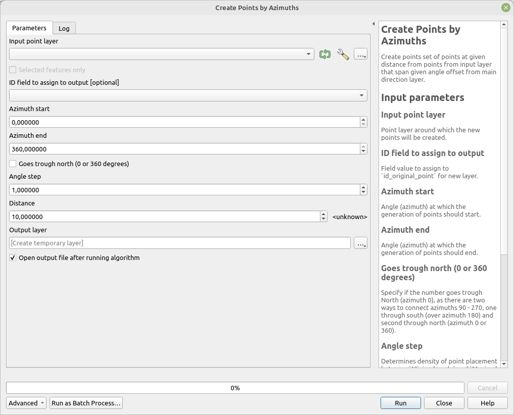

# Create Points by Azimuths

Creates a set of points at a specified distance from points in the input layer, spanning a given angle offset from the main direction layer.

The default values create points from angle 0 (north) to angle 360 (almost north) by one 1 degree, which means 360 points (one point per degree). But smaller section can be generated. For example just wedge from 90 to 180 degrees. It is possible to also select the opposite wedge by checking _Goes trough north (0 or 360 degrees)_ option. That will generate values from 180 to 360 and then 0 to 90 to fulfill the requirement.

## Parameters

| Label                                | Name          | Type                                     | Description                                                                                                                                                                                 |
| ------------------------------------ | ------------- | ---------------------------------------- | ------------------------------------------------------------------------------------------------------------------------------------------------------------------------------------------- |
| Input point layer                    | `InputLayer`  | [vector: point]                          | Point layer around which the new points will be created.                                                                                                                                    |
| ID field to assign to output         | `IdField`     | [tablefield: numeric]                    | Field value to assign to `id_original_point` for the new layer.                                                                                                                             |
| Minimal angle                        | `AngleStart`  | [number]    Default:   `0`   | Angle (azimuth) at which the generation of points should start.                                                                                                                             |
| Maximal angle                        | `AngleEnd`    | [number]    Default:   `359` | Angle (azimuth) at which the generation of points should end.                                                                                                                               |
| Goes trough north (0 or 360 degrees) | `OverNorth`   | [boolean]  Default: `True`       | Specify if the angle spans through North (azimuth 0). There are two ways to connect azimuths 90 - 270: one through south (over azimuth 180) and the other through north (azimuth 0 or 360). |
| Angle step                           | `AngleStep`   | [number]    Default:   `1`   | Determines density of point placement between `Minimal angle` and `Maximal angle`. Angular distance of points. Number of points will be (`Maximal angle` - `Minimal angle`) / `AngleStep`.  |
| Distance                             | `Distance`    | [number]    Default:   `10`  | Distance from the original point at which the new points should be created.                                                                                                                 |
| Output layer                         | `OutputLayer` | [vector: point]                          | Output layer containing the new points.                                                                                                                                                     |

## Outputs

| Label        | Name          | Type            | Description                             |
| ------------ | ------------- | --------------- | --------------------------------------- |
| Output layer | `OutputLayer` | [vector: point] | Output layer containing the new points. |

### Fields in the output layer

* __id_original_point__ - integer - value from field specified in `ID field to assign to output`
* __azimuth__ - double - azimuth from original point to the given output point
* __angle_step_between_points__ - double - azimuth step between individual points

## Tool screenshot

