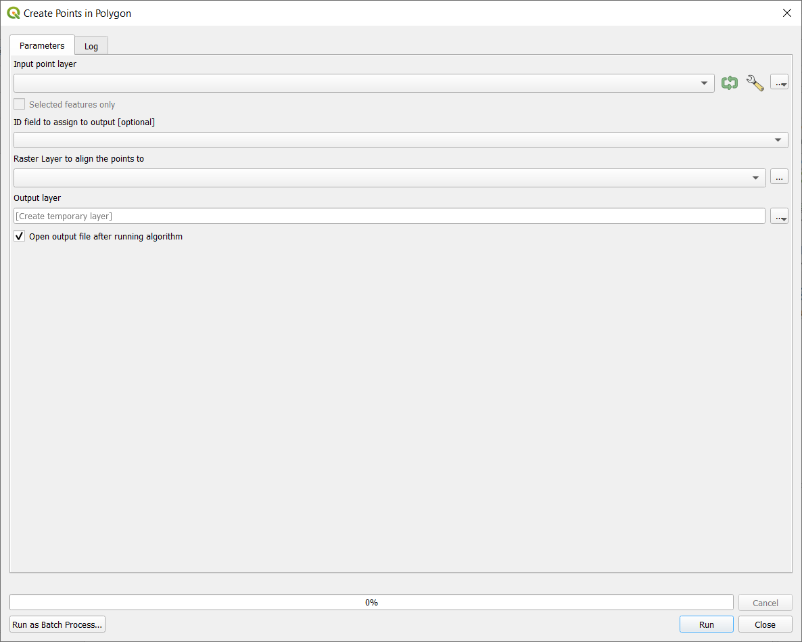

# Create points in polygon

Creates points in provided polygon layer that are aligned with centers of cells of provided raster layer. 

## Parameters

| Label | Name | Type | Description |
| --- | --- | --- | --- |
| Input polygon layer | `InputLayer` | [vector: polygon] | Polygon layer in which the new points will be created. |
| ID field to assign to output | `IdField` | [tablefield: numeric] | Field value to assing to new layer. |
| Raster Layer to align the points to | `InputRaster` | [raster] | Centers of cells from this layer are used as possible places for placing points, if they are inside the polygons. |
| Output layer | `OutputLayer` | [vector: point] | Output layer containing points. |

## Outputs

| Label | Name | Type | Description |
| --- | --- | --- | --- |
| Output layer | `OutputLayer` | [vector: point] | Output layer containing points. |

### Fields in the output layer

* `IdField` - numeric - value selected fom the `InputLayer`

## Tool screenshot

	