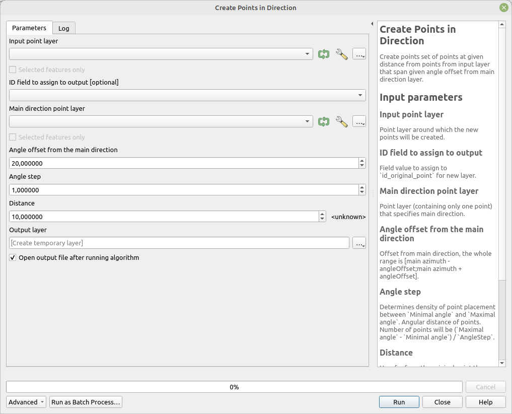

# Create Points in Direction

Creates a set of points at a given distance from points in the input layer, spanning a specified angle offset from the main direction layer.

The default value produces range of values [-20;20] by one angle from azimuth of point in main direction layer.

## Parameters

| Label                                | Name             | Type                                    | Description                                                                                                                                                                                                 |
| ------------------------------------ | ---------------- | --------------------------------------- | ----------------------------------------------------------------------------------------------------------------------------------------------------------------------------------------------------------- |
| Input point layer                    | `InputLayer`     | [vector: point]                         | Point layer around which the new points will be created.                                                                                                                                                    |
| Main direction point layer           | `DirectionLayer` | [vector: point]                         | Point layer (containing only one point) that specifies the main direction.                                                                                                                                  |
| ID field to assign to output         | `IdField`        | [tablefield: numeric]                   | Field value to assign to `id_original_point` for the new layer.                                                                                                                                             |
| Angle offset from the main direction | `AngleOffset`    | [number]    Default:   `20` | Offset from the main direction. The whole range is [main azimuth - angleOffset; main azimuth + angleOffset].                                                                                                |
| Angle step                           | `AngleStep`      | [number]    Default:   `1`  | Determines the density of point placement between `Minimal angle` and `Maximal angle`. The angular distance between points. The number of points will be (`Maximal angle` - `Minimal angle`) / `AngleStep`. |
| Distance                             | `Distance`       | [number]    Default:   `10` | Distance from the original point at which the new points should be created.                                                                                                                                 |
| Output layer                         | `OutputLayer`    | [vector: point]                         | Output layer containing the new points.                                                                                                                                                                     |

## Outputs

| Label        | Name          | Type            | Description                             |
| ------------ | ------------- | --------------- | --------------------------------------- |
| Output layer | `OutputLayer` | [vector: point] | Output layer containing the new points. |

### Fields in the output layer

* __id_original_point__ - integer - value from field specified in `ID field to assign to output`
* __azimuth__ - double - azimuth from point in Input point layer to point in Main direction point layer
* __id_point__ - integer - unique id value for the point
* __difference_to_main_azimuth__ - double - difference of main point azimuth to this point's azimuth
* __angle_step_between_points__ - double - azimuth step between individual points

## Tool screenshot

