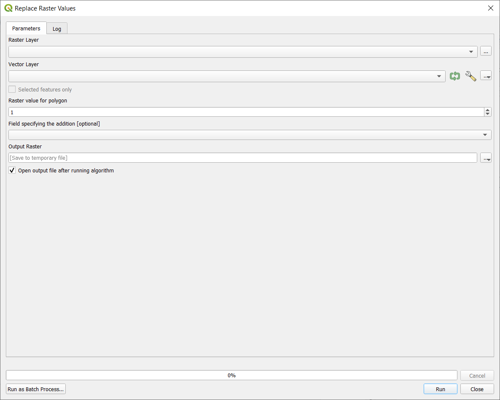

# Replace Raster Values

Tool to replace raster values in polygons with either constant value (specified by `RasterValue`) or by field value (defined by `ValueField`). 

## Parameters

| Label                         | Name           | Type                  | Description                                                                                 |
| ----------------------------- | -------------- | --------------------- | ------------------------------------------------------------------------------------------- |
| Raster Layer                  | `RasterLayer`  | [vector: line]        | Raster layer to use as base.                                                                |
| Vector Layer                  | `VectorLayer`  | [vector: polygon]     | Vector layer that specifies areas of raster to replace the values.                          |
| Raster value for polygon      | `RasterValue`  | [number]              | Value to use as replacement.                                                                |
| Field specifying the addition | `ValueField`   | [tablefield: numeric] | Field from vector layer that defines values that should be used in output raster. Optional. |
| Output Raster                 | `OutputRaster` | [raster]              | Output raster with new values.                                                              |

## Outputs

| Label         | Name           | Type     | Description                    |
| ------------- | -------------- | -------- | ------------------------------ |
| Output Raster | `OutputRaster` | [raster] | Output raster with new values. |

## Tool screenshot

	