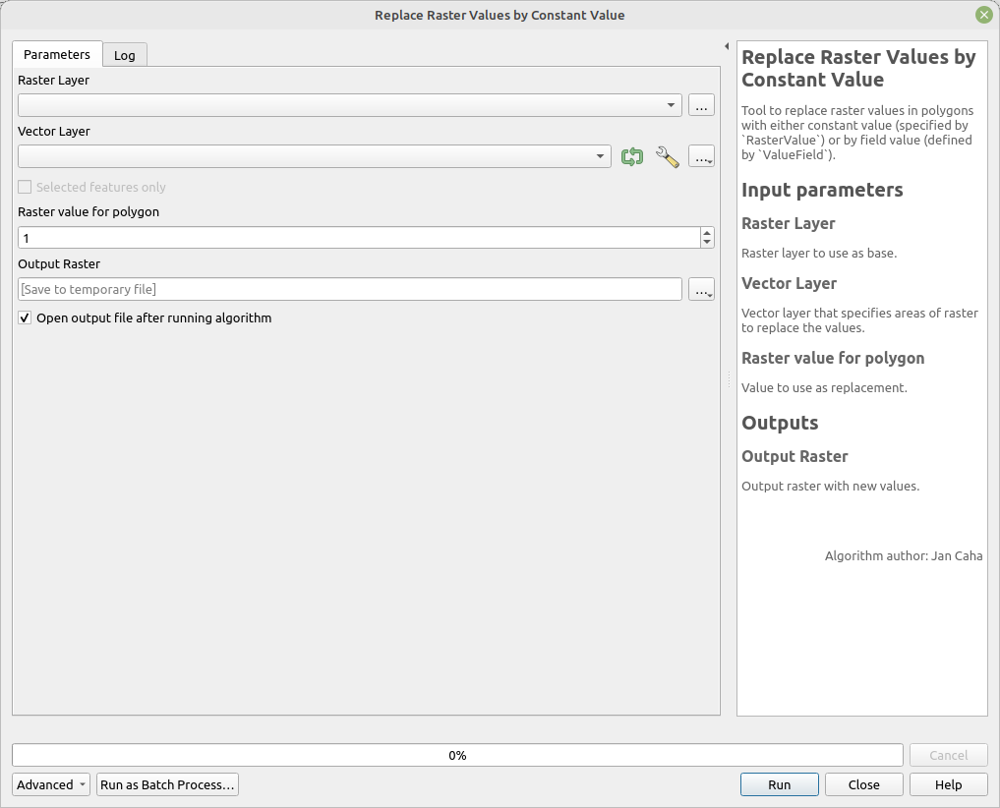

# Replace Raster Values by Constant Value

Tool to replace raster values in polygons with either constant value (specified by `RasterValue`). 

## Parameters

| Label                    | Name           | Type              | Description                                                        |
| ------------------------ | -------------- | ----------------- | ------------------------------------------------------------------ |
| Raster Layer             | `RasterLayer`  | [vector: line]    | Raster layer to use as base.                                       |
| Vector Layer             | `VectorLayer`  | [vector: polygon] | Vector layer that specifies areas of raster to replace the values. |
| Raster value for polygon | `RasterValue`  | [number]          | Value to use as replacement.                                       |
| Output Raster            | `OutputRaster` | [raster]          | Output raster with new values.                                     |

## Outputs

| Label         | Name           | Type     | Description                    |
| ------------- | -------------- | -------- | ------------------------------ |
| Output Raster | `OutputRaster` | [raster] | Output raster with new values. |

## Tool screenshot

	