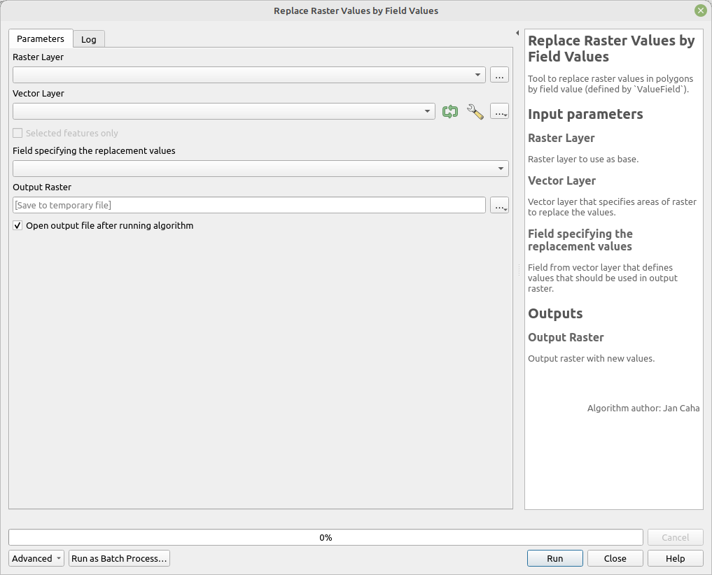

# Replace Raster Values by Field Values

Tool to replace raster values in polygons with field values (defined by `ValueField`). 

## Parameters

| Label                        | Name           | Type                  | Description                                                                       |
| ---------------------------- | -------------- | --------------------- | --------------------------------------------------------------------------------- |
| Raster Layer                 | `RasterLayer`  | [raster]              | Raster layer to use as base.                                                      |
| Vector Layer                 | `VectorLayer`  | [vector: polygon]     | Vector layer that specifies areas of raster to replace the values.                |
| Field specifying replacement | `ValueField`   | [tablefield: numeric] | Field from vector layer that defines values that should be used in output raster. |
| Output Raster                | `OutputRaster` | [raster]              | Output raster with new values.                                                    |

## Outputs

| Label         | Name           | Type     | Description                    |
| ------------- | -------------- | -------- | ------------------------------ |
| Output Raster | `OutputRaster` | [raster] | Output raster with new values. |

## Tool screenshot

	